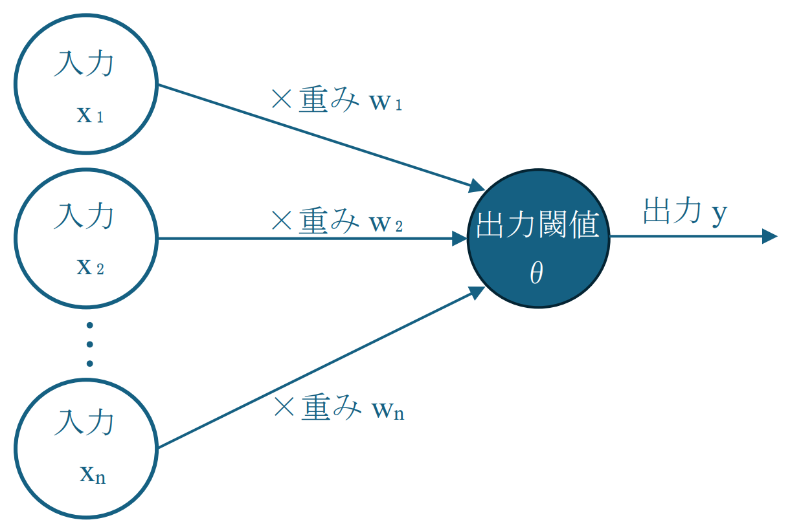
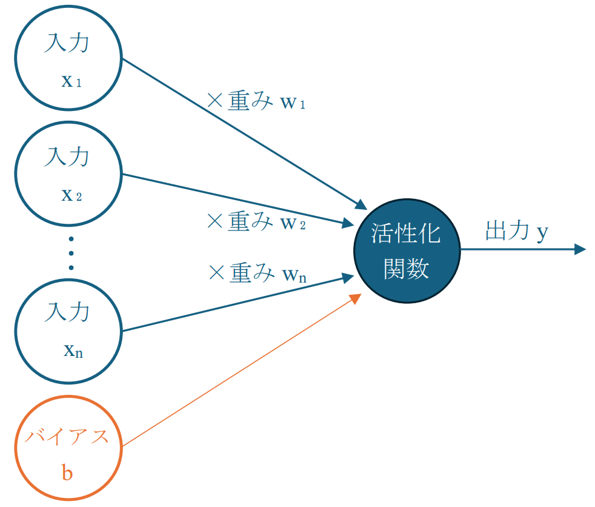
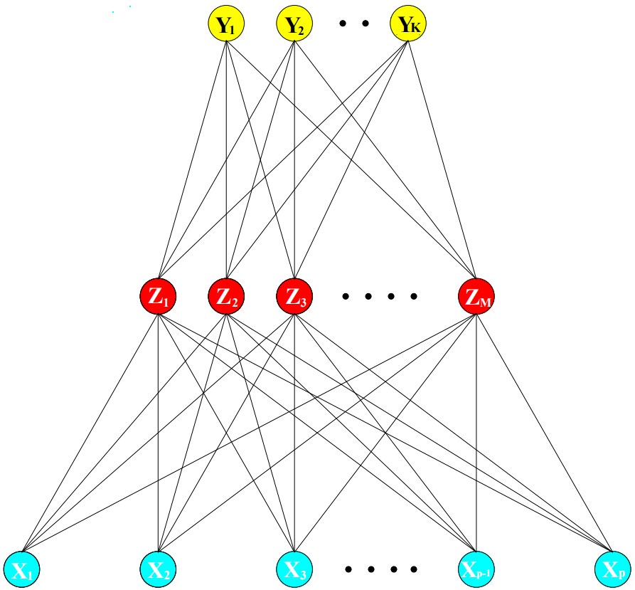

## 11.2. 射影追跡回帰(projection pursuit regression, PPR)
射影追跡回帰は回帰モデルの一種で、以下の式で表される。\
ただし、入力$X$は縦ベクトル、$\omega_m$は縦ベクトル、$M$は**非線形の関数の数**である。\
また、関数$g_m$は**事前に形状は定められておらず**、平滑化手法によって推定される。
$$f(X) = \sum^M_{m = 1} g_m (\omega^T_m X) \tag{11.1}$$

### 特徴
 - 説明変数に**平滑化関数を適用する前に**、最適な方向における**行列を最初に予測する**ことで加法モデルを拡張
 - **リッジ関数**$g_m (\omega^T_m X)$は**非線形関数**で、うまく取れば$M$が大きくても任意の精度で近似可能

---
例外として、非線形の関数の個数$M = 1$の場合は、**単一指標モデル**と呼ばれる。\
このモデルは、線型回帰を**わずかに一般化した**ものと考えられ、以下の式で表せる。
$$f(X) = g_1 (\omega^T_1 X)$$

---
訓練データ$(x_i, y_i) 　 (i = 1, 2, ..., N)$に対して当てはめを行うには、式(11.2)の誤差関数を利用する。\
リッジ関数$g_m$及び重み$\omega_m$を**近似的に最小化**すれば良い。\
ただし、過学習を避けるために$g_m$の**複雑度に関する制約は必須**である。

$$\sum^N_{i=1} \bigg[ y_i - \sum^M_{m = 1} g_m (\omega^T_m x_i) \bigg]^2 \tag{11.2}$$

---
射影追跡回帰の手順は以下のとおりである。
1. 標本の準備
 入力データを**中心化**/**球状化** (まとめて**白色化**と言う)
2. 重み$\omega$が収束するまで更新する

---
### 射影追跡回帰のメリット
1. **予測**に有用
2. **非線形関数**で表現可
 $\rightarrow$ 線形回帰では見逃す関係を捕捉可
3. 次元の呪いの回避
 $\rightarrow$ 高次元データで利用可

### 射影追跡回帰のデメリット
- 解釈性に乏しい

---

## 11.3. ニューラルネットワーク(NN)
NNとは、人間の脳神経系のニューロンを数理モデル化したもの。\
これは、**複数の段階で構成される回帰/分類モデル**と考えることができる。

### 特徴
+ 近いモデルである**パーセプトロン**では解けなかった**線形分離不可**な問題に対応可
+ NNは**活性化関数$\sigma(v)$の総和**を考えるため射影追跡回帰の特別な場合と考えられる

---
下図の球体を**ユニット**及び**ニューロン**、ユニット間を結ぶ線を**シナプス**という。

**ニューロンモデル**とは、各入力値$x_n$に対応する**重み**$w_n$をかけた総和が閾値$\theta$を超えるかどうかを調べるものである。
<!-- ニューロンモデルの図(自作、引用) -->

  

---
**パーセプトロン**はニューロンモデルに似ており、各入力$x_n$と対応する重み$w_n$の積に、**バイアス**$b_n$を加えたものの総和が**0以上か未満か**を調べるものである。\
出力は**活性化関数**$\sigma$を使って書くことができる。
$$y = \sigma \bigg( \sum^n_{i=1} x_i w_i + b_i \bigg)$$

<!-- パーセプトロンの図(自作、引用) -->

  

---
下図が**NN**である。入力を受け取る$X_p$のある1層目を**入力層**、結果を出力する$Y_K$のある最後の層を**出力層**、その間の導出特徴量$Z_M$のある全ての層を**中間層**という。

<!-- ESLのfig11.2 -->

  

---

NNは、多数のパーセプトロンを集めて繋げたものだと考えられる。\
この際、活性化関数としては以下の3種類が使われることが多い。
1. **シグモイド関数**$\sigma(v) = 1/(1 + exp(-v))$
2. **ReLU関数** $f(x) = \bigg\{ \begin{align} 0 \  (0 > x) \\ x \  (0 \leq x) \end{align}$
3. **動径基底関数** ... 距離のみに基づいて値が決まる**動径関数**の線形和

---
前ページの導出特徴量$Z_M$、目的変数$Y_K$は以下の式で表される。
$$\begin{align}
Z_m &= \sigma(\alpha_{0m} + \alpha^T_m X), 　 (m = 1, ..., M) \\
T_k &= \beta_{0k} + \beta_k^T Z , 　 (k = 1, ..., K) \\
Y_k&= f_k(X) = g_k (T), 　 (k = 1, ..., K)
\end{align}\tag{11.5}$$
ただし、$Z = (Z_1, Z_2, ..., Z_M)^T$、$T = (T_1, T_2, ..., T_K)^T$である。

また、**出力関数**$g_k$は**出力ベクトル**$T$を**最終形態**$Y$に変換する役割がある。
これには、**ソフトマックス関数**が使われることが多い。
$$g_k(T) = \frac{e^{T_k}}{\sum^K_{l=1} e^{T_l}} \tag{11.6}$$

---

## 11.4. NNの当てはめ
NNの**重み(weight)は未知**であり、訓練データへの当てはめのために**重みを求める必要**がある。\
全ての重みを$\theta$とし、構成要素は以下のようにする。
$$\begin{align}
\{\alpha_{0m}, \alpha_m; m &= 1,2, ..., M\} \\
\{\beta_{0k}, \beta_k; k &= 1,2, ..., K\}
\end{align} \tag{11.8}$$

---
当てはまりの度合いの尺度として、**誤差関数**$R(\theta)$を導入する。
- 誤差関数とは、予測値と真の値の誤差

回帰の場合には、として**誤差の2乗和**が使われる。
$$R(\theta) = \sum^K_{k=1} \sum^N_{i=1} (y_{ik} - f_k(x_i))^2$$
分類の場合には、前述の誤差の2乗和か**交差エントロピー**が使われる。
$$R(\theta) = - \sum^N_{i=1} \sum^K_{k=1} y_{ik} \log f_k(x_i) $$

---
分類機が$G(x) = argmax_k f_k(x)$で設計される。\
活性化関数と誤差関数に**ソフトマックス関数と交差エントロピー**を使うと、隠れ層を入力とした**ロジスティック回帰**と等価である。
 $\rightarrow$ 全ての未知パラメータを**最尤法で推定**可能に

ただし、誤差関数$R(\theta)$の大域最適解は必要なく、任意の正則化を行えば良い。
 $\rightarrow$ 訓練データに**過学習**しているため

---
予測値と真の値の誤差である誤差関数は最小化が必要であり、一般的に**勾配降下法**が使われる。\
特にNNでは、 **逆伝播**または**誤差逆伝播法**等と呼ばれる。\
誤差関数は微分可能なので、容易に勾配が計算できる。\
よってネットワーク上を**前向き/後ろ向き**に走査すればよい。

---
誤差逆伝播法は、更新式を使い**誤差関数を調整**する工程を**複数回**行う。
まず、誤差関数$R(\theta)$を書き直す。
$$R(\theta) \equiv \sum^N_{i = 1} R_i$$
$$ \ \ \ \ \ \ \ \ \ \ \ \ \ \ \ \ \ \ \ \ \ \ \ \ \ \ \ \ \ \ \ \ \ \ \  = \sum^N_{i=1} \sum^K_{k=1} (y_{ik} - f_k(x_i))^2 \tag{11.11}$$

荷重についての導関数は、以下の様に得られる。
$$\begin{align}
\frac{\partial R_i}{\partial \beta_{km}} &= -2(y_{ik} - f_k(x_i)) g_k' (\beta^T_m z_i) z_{mi} \\
\frac{\partial R_i}{\partial \alpha_{m;} }&= -2 \sum^K_{k=1} (y_{ik} - f_k(x_i)) g_k' (\beta^T_m z_i) \beta_{km} \sigma (\alpha_m^T x_i) x_{il}
\end{align} \tag{11.12}$$

---
勾配降下法に基づいて、$(r+1)$番目の更新式は以下のように表される。\
ただし、$\gamma_r$は**学習率**である。
$$\begin{align}
\beta^{(r+1)}_{km} &= \beta^{(r)}_{km} - \gamma_r \sum^N_{i=1} \frac{\partial R_i}{\partial \beta^{(r)}_{km}} \\
\alpha^{(r+1)}_{ml} &= \alpha^{(r)}_{ml} - \gamma_r \sum^N_{i=1} \frac{\partial R_i}{\partial \alpha^{(r)}_{ml}}
\end{align} \tag{11.13}$$

---
また、誤差関数の各偏微分を**現時点でのユニットでの誤差**$\delta_{ki}$、$s_{mi}$を使って表す。
$z_{mi} = \sigma(\alpha_{0m} + \alpha^T_m x_i)$と定義すると、
$$\begin{align}
\frac{\partial R_i}{\partial \beta_{km}} = \delta_{ki} z_{mi} \\
\frac{\partial R_i}{\partial \alpha_{ml}} = s_{mi} x_{il}
\end{align} \tag{11.14}$$

$\delta_{ki}, s_{mi}$の2種の誤差から**逆伝播等式**を求められる。
$$s_{mi} = \sigma ' (\alpha_m^T x_i) \sum^K_{k = 1} \beta_{km} \delta_{ki} \tag{11.15}$$

---
(11.13)の更新式と逆伝播等式を使うことで、**2段階の走査のアルゴリズム**として実装できる。
1. **前向き走査**
 現時点の重みを**固定**して、逆伝播等式より関数の**予測値**$\hat f(x)$を計算
2. **後ろ向き走査**
 出力ユニットの誤差項$\delta_{ki}$を計算し、**逆伝播等式に代入**し誤差を逆伝播\
 同様に、隠れユニットの誤差項$s_{mi}$を計算し、(11.14)式に代入して**勾配を計算**

この1と2を繰り返すことで、誤差関数を最小化できる。

---
(11.13)の更新式は、**バッチ学習**でおり**全訓練データ**を元にパラメータが更新される。
この学習方法では、学習率$\gamma_r$は定数とすることが多い。

一方で、各時点で訓練データ毎に**その場で勾配を更新する**作業を全訓練データにおいて何度か繰り返す**オンライン学習**も可能である。\
この際、全訓練データに対して1回の学習の走査を**訓練エポック**と呼ぶ。\
この学習方法では、学習率$\gamma_r$を減らしていくことが妥当である。
- 具体的には$r \rightarrow \infty$に近似した際、$\gamma_r \rightarrow 0, \sum_r \gamma_r = \infty \ \cap \ \sum_r \gamma_r^2 < \infty$が成り立てば、学習の**収束が保証**される。\
 こういった方法は、**確率的近似**と呼ばれる手法である。

逆伝播のデメリットとして、収束の速度に**導関数が依存**しており、0に近づくと極めて遅くなる。

---

## 11.5.1. NNの訓練時の問題点 : 初期値
重み$\alpha, \beta$が**ほぼ0**だとシグモイド関数が**狭い区間で線形**と見なせてしまう。
更に、重みが**完全に0**になると、微分値が0になり**重みが更新されなく**なってしまう。

重みの初期値を0付近のランダムな値を取ることには、以下の3つのメリットがある。
1. **重みベクトルが局在化**するように初期化できている
2. 必要に応じて**非線形性**が導入される
3. 望ましい値に収束しやすい

---

## 11.5.2. NNの訓練時の問題点 : 過学習
NNは**重みパラメータを多数**に含むため、誤差関数の大域的最小解は**過学習**になりがち
過学習の対策として、以下の2つの手法がある。
1. 早期停止
2. **荷重減衰**
 線形モデルにおける**リッジ回帰**に相当手段である。

---
### 荷重減衰
誤差関数$R(\theta)$に罰則項$J(\theta)$を加え、**新たな誤差関数**$R(\theta) + \lambda J(\theta), \ \lambda \geq 0$を設計。\
この時、$\lambda$は**調整可能**なパラメータで、$\lambda$を大きくすると重みは$0$になりやすくなる。\
実用上では、$\lambda$の値は**交差確認**によって推定する。\
また、罰則項は以下の(11.16)式により与えられる。
$$J(\theta) = \sum_{k,\ m} \beta^2_{km} + \sum_{m,\ l} \alpha^2_{ml}$$

これらの罰則項の他に、**荷重消去罰則項**も存在する。
上記の罰則項より、**重みを小さく**する効果が大きい。
$$J(\theta) = \sum_{k,\ m} \frac{\beta^2_{km}}{1 + \beta^2_{km}} + \sum_{m,\ l} \frac{\alpha^2_{ml}}{1 + \alpha^2_{ml}} \tag{11.17}$$

---

## 11.5.3. NNの訓練時の問題点 : 入力のスケーリング
入力変数をスケーリングせずに利用すると、**最下層の重みへの影響**が大きくなり、結果的に最終的な出力にも影響を与える。\
よって、入力変数は平均$0$、標準偏差$1$となるように**標準正規化**しておくべきである。

これによりランダムに決める**重みの初期値の範囲**を適切に設定することができる。\
これは、経験則により$[-0.7, 0.7]$と設定されることが多い。

---

## 11.5.4. NNの訓練時の問題点 : 隠れユニット/隠れ層の数
中間層のことを**隠れ層**といい、ここに含まれるユニットを**隠れユニット**という。\
この隠れユニットの個数は、少なすぎるよりは**多すぎる方が望ましい**。

### 隠れユニットが少ない
- データの非線形性を吸収して柔軟性を持たせることが**難しい**

### 隠れユニットが多い
- 複雑な分類が可能になるが、過学習の要因になる\
 $\rightarrow$ 正則化により、**余分な重みを0**にすれば過学習を防げる。

実用上では、最適なユニット数や正則化パラメータに対して、**交差確認**を利用する。

---

## 11.5.5. NNの訓練時の問題点 : 複数の極小解
**誤差関数**$R(\theta)$は**非凸**でかつ**多数の極小解**をもつ。\
 $\rightarrow$ 重みの**初期値の選択に依存**\
対策として、以下の3つの様な手法がある。
1. 重みの初期値の集合を用意して、**最小の誤差**を与えるものを**最適解**として選択
2. 重みの初期値を複数個用意して、得られた多数の**ネットワークの出力を平均化**して、最終的な出力とする
3. **バギング**を利用して、**訓練データの一部からNNを作成**する工程を複数回行い、それらの予測値を平均化

---

## 11.7 畳み込みニューラルネットワーク(CNN)
CNNは**畳み込み層**と**プーリング層**、**全結合層**の3種の層を中間層内に持つNNである。
1. **畳み込み層**
 入力の一部を**まとめて1つの入力**とする層。
 画像なら、$N\times N$ピクセル$\mathbf P$とカーネル$\mathbf K$の畳み込み$\mathbf P * \mathbf K$を特徴量とする。
2. **プーリング層**
 入力の**サイズを削減**する層。
 後の層で扱いやすくするためにある。
 画像内の各$N\times N$ピクセルごとに代表値を選択することでデータ量を削減する。
3. **全結合層**
 上記の2層の**全ての要素**と接続する層。
 主に最後の判定を行う層で使われる。

---

## 11.8. PPRとNNの共通点
- 入力に対する線型結合(**導出特徴量**)が**非線形関数**の形\
 $\rightarrow$ **信号対雑音比**が高いデータでも利用可
- 各入力が**モデルの様々な場所**で、非線形関数を通して取り込まれる。\
 $\rightarrow$ データ生成の過程や解釈性に難あり

---

## 11.9. NNの性能評価
NNの性能評価では、以下のような手法を組み合わせて評価する。
+ 推論性能(**ACC**) ... 正しく分類される確率
+ **ROC曲線** ... **TPR**と**FPR**を元に作られた曲線
+ **AUC** ... ROC曲線の右下の領域の面積
+ **MAE**/**MSE** ... 真の値と予測値の差の**絶対値の平均**及び**2乗した値の平均**

---

## 11.9.1. ベイジアンニューラルネットワーク(BNN)
通常のNNでは、重みは学習の結果収束した定数である。
しかし、BNNでは重みは**ある確率分布に基づいて出力された確率変数**とする。

また、BNNに似ている手法に**ドロップアウト**というものがある。
これは、エポック毎に**中間層のユニットを一定確率で無効化する**手法である。
 $\rightarrow$ **ブースティング**に似ている

どちらも過学習防止の効果がある。

---

## 11.10. 計算上考慮すべき事柄
NNの当てはめには、$N$個の観測、$p$次元の入力変数、$M$個の隠れユニット、$L$個の訓練エポックより **$O(NpML)$の計算量が必要**になる。\
また、ソフトウェア毎の計算量や予測精度のばらつきが大きい点より、目的に応じたソフトウェア選択が必要である。

---
## 参考文献

[1] 射影追跡回帰 - Wikipedia (参照 : 2025/07/03)
https://ja.wikipedia.org/wiki/%E5%B0%84%E5%BD%B1%E8%BF%BD%E8%B7%A1%E5%9B%9E%E5%B8%B0

[2] 初心者の初心者による初心者のためのニューラルネットワーク#1〜理論：順伝播編〜 #機械学習 - Qiita (参照 : 2025/07/10)
https://qiita.com/sakigakeman/items/55f4cc1c50f8236ac7a6

[3] 【初心者向け】ねこでも分かるニューラルネットワーク超入門 #Python - Qiita (参照 : 2025/07/10)
https://qiita.com/NekoAllergy/items/489a4158b15231936f11

[4] 何故ニューラルネットの予測能力は射影追跡回帰を上回るのか - jstage (参照 : 2025/07/10)
https://www.jstage.jst.go.jp/article/oukan/2007/0/2007_0_115/_pdf/-char/ja

---

[5] 誤差逆伝播法を完全に理解したので説明する (参照 : 2025/07/10)
https://zenn.dev/yuto_mo/articles/4607b7feb8ce8b

[6] 誤差逆伝搬法の理論を計算してみる (参照 : 2025/07/10)
https://zenn.dev/yuto_mo/articles/b56e1fc2215c8b

[7] Hidden Unit/Layer(隠れユニット/隠れ層)の基本 #機械学習 - Qiita (参照 : 2025/07/10)
https://qiita.com/yuxzux/items/8c17a602047022637662

[8] Convolutional Neural Networkとは何なのか #Python - Qiita (参照 : 2025/07/10)
https://qiita.com/icoxfog417/items/5fd55fad152231d706c2

---

[9] 畳み込みニューラルネットワーク(CNN)をわかりやすく基本から実装まで解説 – 体験型学習ブログ by zero to one (参照 : 2025/07/10)
https://zero2one.jp/learningblog/cnn-for-beginners/?srsltid=AfmBOoofaQtM2NWskPMdzM9zItk1LfTHK1oQTB_aBxSMMQ9N37idTugp

[10] ニューラルネットワークにおけるエポック数の評価と最適化方法 (参照 : 2025/07/12)
https://jp.linkedin.com/pulse/%E3%83%8B%E3%83%A5%E3%83%BC%E3%83%A9%E3%83%AB%E3%83%8D%E3%83%83%E3%83%88%E3%83%AF%E3%83%BC%E3%82%AF%E3%81%AB%E3%81%8A%E3%81%91%E3%82%8B%E3%82%A8%E3%83%9D%E3%83%83%E3%82%AF%E6%95%B0%E3%81%AE%E8%A9%95%E4%BE%A1%E3%81%A8%E6%9C%80%E9%81%A9%E5%8C%96%E6%96%B9%E6%B3%95-%E5%A4%AA%E4%B8%80-%E9%81%A0%E8%97%A4-pdfkc

[11] AUCをちゃんと説明できないはずがない (参照 : 2025/07/12)
https://zenn.dev/d2c_mtech_blog/articles/38dd54be656ba9

---

[12] ベイジアンニューラルネットワークと予測の不確実性について #DeepLearning - Qiita (参照 : 2025/07/12)
https://qiita.com/qiita_kuru/items/8d20986b51c8e57e51b5#%E3%83%99%E3%82%A4%E3%82%B8%E3%82%A2%E3%83%B3%E3%83%8B%E3%83%A5%E3%83%BC%E3%83%A9%E3%83%AB%E3%83%8D%E3%83%83%E3%83%88%E3%83%AF%E3%83%BC%E3%82%AF
