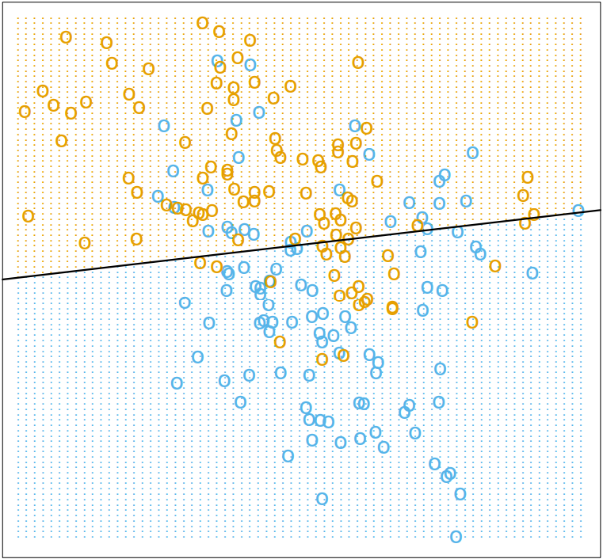
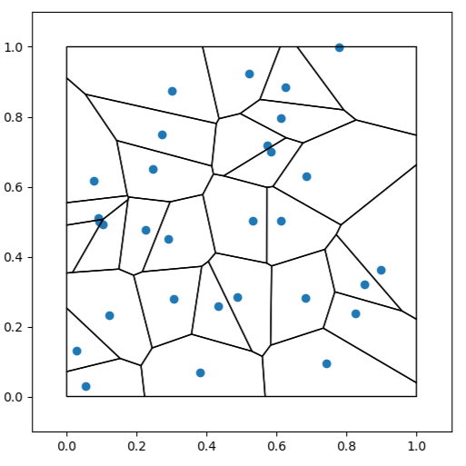
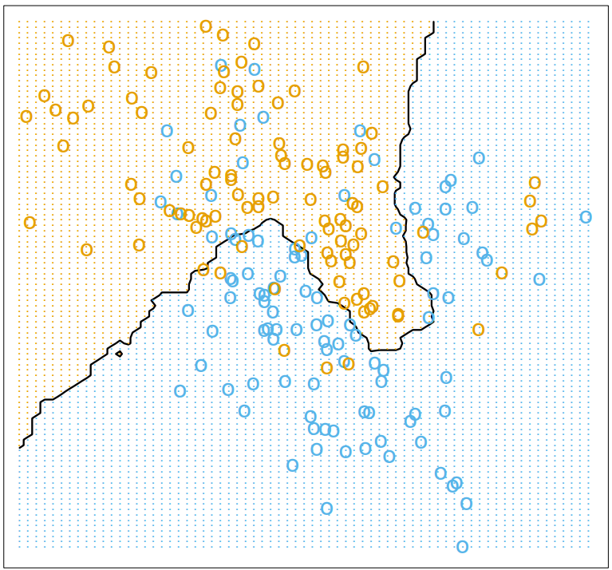

# 2.1. 教師あり学習の概要
**教師あり学習**とは、入力された変数から出力の変数を予測することである。\
教師あり学習の変数には以下の2種類がある。
- **応答変数 (response variable)** … 予測した結果として出力される変数。
- **予測変数 (predictor)** … 応答変数を予測するために使われる変数。

---

# 2.2. 変数の種類と用語
変数全体として、離散値を取る**離散型**の変数と連続値を取る**連続型**の変数が存在する。その中で、出力変数にもいくつかの種類があり、そのうちの4つを以下に示す。
1. **量的変数 (quantative variable)** … 数値で表すことができ、大小関係が存在する変数のこと。 例) 年齢、身長、体重 etc
2. **質的変数 (quanlitative variable)** … 数値の大小に意味はなく、種類や分類を区別するための変数。 例) 名前、血液型、職業 etc 
3. **カテゴリ型変数 (categorival variable)** … 質的変数を量的変数に置き換えた変数。 例) {女性, 男性} -> {\-1, 1} etc
4. **順序付きカテゴリ型変数** … 値の順序に意味はあるが、計算としての意味は存在しない変数。 例) {大, 中, 小} -> {1, 2, 3}

---

質的変数を数値として表現する際の方法としては以下の2つのようなものがある。
1. 2クラス分類 … 2つのカテゴリを**0と1**または<strong>-1と1</strong>のように2値を使って表す方法\
 例) アンケートの回答 {はい, いいえ} -> {1, 0} etc
2. **ダミー変数(One-hot Encoding)** … 3つ以上のカテゴリがある場合は、**カテゴリ毎の変数**を用意して、カテゴリに**当てはまる場合は1**、**そうでない場合は0**という風に数値を当てはめる方法である。
 例) 趣味 {読書, スポーツ, ドライブ} -> {1, 0, 0}, {0, 0, 1}, {0, 1, 0}

---

予測問題にもいくつかの種類があり、出力の違いによって名称が異なる。
1. **回帰** … 量的変数を予測する問題。
2. **分類** … 質的変数を予測する問題。

また、予測のための規則を生成するために使われるデータを**訓練データ**といい、予測変数を出力する学習器をデータを元に訓練することを**学習**という。

---

# 2.3.1. 最小2乗法
線形モデルでは、入力ベクトル$X^{T} = (X_1, X_2, ..., X_p)$が与えられたとき、出力$Y$を、
$$\hat{Y}=\hat{β_0}+\sum^{p}_{j=1}X_{j}\hat{β_j}$$
と予測する。
このとき、$β_0$は切片であり、**バイアス(bias)** とも呼ばれることがある。\
また、$X_0=1$とすると内積の形を使って表記を簡潔にすることができる。
$$\hat{Y}=X^{T}\hat{β}$$

---

次に、線形モデルに訓練データを当てはめる方法を考える。\
最も有名な方法として、**最小2乗法(least squares)** がある。\
これは、残差2乗和$RSS$を最小にする$β$を選択することで、予測に必要な$\hat{β}$を求める方法である。
$$RSS(β) = \sum^{N}_{i=1}(\hat{y_i} - f(x_i^T β))^2$$
上記の$RSS(β)$においては、2次関数であるので必ず最小値は存在する。\
簡潔の為に行列表記に書き下すこともできる。
$$RSS(β) = (y - Xβ)^T (y - Xβ)$$
この時$X$は$N×p$ 行列なので、$y$は$N$次元ベクトルである。\
これを、$β$に関して偏微分すると、**正規方程式 (normal equation)** が得られる。
$$X^T (y - Xβ) =0$$

---

正規方程式は、$X^T X$が特異でなければ、一意な解を持つ。\
この際、特異な行列$X$とは$N > p$等の時に得られる。
$$\hat{β} = (X^T X)^{-1}X^T y$$
これにより、任意の入力$x_0$に対して$x_0^T \hat{β}$が予測値となる。

また、分類問題において応答変数の値が変化する境界を**決定境界(decision boundary)** という。\
しかし、線形モデルでは全てが正しく分類されるわけではなく、柔軟性の欠如や本質的に避けられないノイズによって誤分類されることもある。

---

以下は、2次元分類問題の例である。\
(青色=0, オレンジ=1)として、線形回帰分析による直線を当てはめている。\
決定境界は$x^T \hat{β}=0.5$となる直線である。\

---

# 2.3.2. 最近傍法
**最近傍法(Nearest Neighbor)** とは、予測したいデータ点$\hat{Y}$を訓練データなどの既存のデータセットに含まれる入力$x$に最も近い隣接点に基づいて分類や予測を行う方法である。\
$k$最近傍法では、訓練データの内の入力$x$に近い$k$個の点$x_i$を元に平均値$\hat{Y}$を取る。
$$\hat{Y} (x) = \frac{1}{k} \sum_{x_i \in N_k(x)} y_i$$
この決定境界は不規則な形状をしているが、決定境界の算出自体は訓練データのボロノイ分割で算出することができる。

---

- **ボロノイ分割(Voronoi Split)** … 各点の周囲のその点が最も近い点となる領域を図示したもの。\
 隣り合う点の間を結ぶ直線に対して、垂直二等分線を引くことで図示できる。\

---

このとき、$k$近傍法を使った回帰問題においては$k=1$が適切な近傍数として選ばれることは少ない。何故なら、訓練データは完全に分類で来ているが、訓練データとは独立したテストデータを用いると誤分類が発生する可能性が大きい。\
また、最小2乗法のパラメータはデータの次元数$p$であるのに対して、最近傍法の有効パラメータ数は近傍数$k$を用いて$N/k$と表される。一般的に、最近傍法の有効パラメータ数$N/k$の方が大きく、$k$の値を増やすことでパラメータ数を減らすことができる。
- 有効パラメータ数 … 行列の中で固有値が比較的大きい物の数、データを表すのに必要な次元の数。

---

以下は、2次元分類問題の例である。\
(青色=0, オレンジ=1)として、15最近傍法によるクラスの予測を行った。\
$\hat{Y} \leq 0.5$なら青色のクラス、それ以外はオレンジのクラスに分類した。\

---

# 2.3.3. 最小2乗法と最近傍法
最小2乗法が有効な場合
- 訓練データが、平均が異なり相関の無い2変数の正規分布からなるとき
 (=分布が単純)

最近傍法が有効な場合
- 訓練データが、複数の正規分布を合成したような、混合正規分布からなるとき
 (=分布が複雑)

---

# 2.4. 統計的決定理論
ここでは、量的出力の問題を考えるために、入力ベクトル$X \in \mathbb{R}$と確率出力変数$Y$を用いて、同時確率分布$Pr(X, Y)$を考える。\
入力$X$が与えられた時、$Y$を予測するための関数$f(X)$を見つけることが目標である。\
正確に予測するためには、**損失関数(loss function)** $L(X, f(X))$を定める必要があり、**2乗誤差損失(squared error loss)** $L(X, f(X)) = (Y - f(X))^2$は特に有用である。
2乗誤差損失における$f$を選ぶ基準としては、**期待予測誤差(expected prediction error)** を使う。
$$EPE(f) = E(Y - f(X))^2 = \int [y - f(x)]^2 Pr(dx, dy)$$

---

同時確率分布について考えているため、同時分布であることから$Pr(Y|X) = Pr(X, Y)/Pr(X)$が使える。
$$EPE(f) = E_X E_{Y|X}([Y - f(X)]^2 | X )$$
$EPE$を最小化するには、それぞれの$x$に関して最小化すれば良い。
$$f(x) = \underset{\text{c}} {argmin} E_{Y|X} ([Y - c]^2 | X = x)$$
この時、解は条件付き期待値であるので、
$$f(x) = E(Y | X = x)$$
この関数$f(x)$を**回帰関数 (regression function)** と呼ぶこともある。\
よって、平均2乗誤差を基準とすると、$X = x$における最良の$Y$の予測は条件付き期待値である。

---

最近傍法では、訓練データを元に条件付き期待値を直接推定する方法であると考えられる。\
何故なら、入力$x_i = x$となる訓練データを集めて、対応する$y_i$の平均を取れば条件付き期待値を推定できる。\
ただし、丁度$x_i = x$となるような点は高々1つ程度しか存在しないので、k最近傍法では、
$$\hat{f} = Ave(y_i | x_i \in N_k(x))$$
を利用して、訓練データにより定義される近傍を利用して近似している。\
一見、k最近傍法は万能な方法に見えるが、次元数$p$が多くなるにつれ、収束性は悪化し、近傍も不正確になってしまう問題が知られている。

---

最小2乗法もk最近傍法も、条件付き確期待値を訓練データに関する平均で近似していると考えられるが、両者はモデルの仮定が異なっている。
- 最小2乗法は、$f(x)$が大域的な線形関数によって上手く近似できるという仮定
- k最近傍法は、$f(x)$が局所的な定数関数によって上手く近似できるという仮定

両者を比較すると、k最近傍法のほうが柔軟性があるモデリングを行っているように見えるが、柔軟性の大小として推定が不安定になっていることがわかる。

---

また、出力がカテゴリ変数$G$であった際の罰則の与え方を考える。\
この場合も、予測誤差に対する罰則を別の損失関数に変更すれば良い。\
推定値$\hat{G}$が、いずれかの値を取る時、損失関数は要素数$K$より$K×K$行列$L$によって与えられる。\
行列$L$は、対角成分が0で非対角成分は非負の値を取る。\
この非負の値の部分に、クラス$\mathcal{G}_k$が誤分類された際の罰則が入っている。\
このような行列$L$の内、全ての誤分類の罰則を1にしたものは**0/1損失関数** と呼ばれ、多くの分類問題で利用されている。

---

この際の期待予測誤差は、
$$EPE = E[L(G, \hat{G}(X))]$$
$$EPE = E_X \sum^K_{k=1} L(\mathcal{G}_k, \hat{G}(X))Pr(\mathcal{G}_k|X)$$
と表すことができ、入力$X$毎に期待予想誤差を最小化すれば良いので、0/1損失関数の場合、
$$\hat{G} (X) = \underset{g \in \mathcal{G}} {argmin} [1 - Pr(g | X=x)]$$
または、
$$\hat{G} (X) = \mathcal{G}_k 　 if 　 Pr(\mathcal{G}_k | X = x) = \underset{g \in \mathcal{G}} {max} Pr(g | X = x)$$
と表すことができる。

---

この解は、条件付き確率$Pr(G|X)$を用いて最も確からしいクラスに分類されていて、これを**ベイズ分類機(Bayes classifier)** と呼ぶ。\
また、ベイズ分類機における最適な決定境界を**ベイズ最適**といい、ベイズ分類機の誤分類率を**ベイズ誤り率(Bayes rate)** という。

---

# 2.5. 高次元での局所的手法
高次元においては、近傍データの平均によって理論的に最適な予測である条件付き期待値がうまく近似することができない。
このような現象を、**次元の呪い(curse of dimensionality)** という。
次元の呪いに直面する事例として、以下の2つの問題をあげる。
1. 高次元では近傍を定義する際に多くのデータが必要になってしまい、**局所的な近傍でなくなってしまう**。(=k最近傍法が使えない)\
 例) 5次元訓練データの内の1%分の近傍データを用意するには、近傍データ数の全データのうちの割合$r$を使って$e_p(r) = r^{1/p}$より約40%のデータが必要。
2. すべての点がデータの中心から離れているため、**近傍点を用いた予測が既知のデータからその範囲外の値を推定**してしまっている。
 (= 外挿が発生している)

---

**バイアス-分散問題(bias-variance decomposition)** … 平均2乗誤差を分散とバイアスの2乗に分解する方法。\

---

# 参考文献
[1] 最小二乗法 - Wikipedia (参照:2025/04/22)\
https://ja.wikipedia.org/wiki/%E6%9C%80%E5%B0%8F%E4%BA%8C%E4%B9%97%E6%B3%95

[2] 最近傍法とk近傍法: Pythonでの実装や違いについて - PyDocument
(参照:2025/04/23)
https://pydocument.hatenablog.com/entry/2023/10/14/004008#%E6%9C%80%E8%BF%91%E5%82%8D%E6%B3%95Nearest-Neighbor

[3] Pythonで有界な（閉じた）ボロノイ図を計算・描画する #scipy - Qiita
(参照:2025/04/23)
https://qiita.com/supbon2/items/30e0cb49c9338e721b8c

--- 

[] 