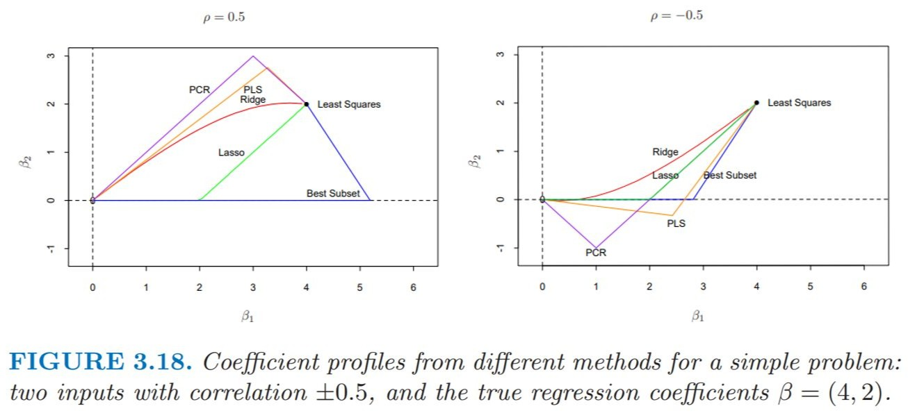

# 3.5. 入力に対して線形変換を行う方法
入力変数が多く、互いに高い相関を持つ際の手法を考える。\
元の入力$X_j$に対して、少数の線型結合$Z_m (m = 1, ..., M)$を計算し、計算結果を入力変数の代わりとして利用する。\
この節では、主成分回帰と部分最小2乗法を扱う。

## 3.5.1 主成分回帰 (Principal Component Regression)
主成分回帰は、以下の流れの繰り返しである。
1. 説明変数のうち、相関のある変数群の線形結合$Z_m$を作り、これを主成分と呼ぶ。 (= **主成分分析**)
2. 主成分のうち、分散の大きい主成分を選ぶ。
3. 累積寄与率が一定値を超えるまで選択し、これを新たな説明変数とする。

入力の主成分を使用していたり、入力変数の大きさに対して不変でないため標準化が必要だったりといった点でリッジ回帰に似ている。
- 主成分分析 ... 相関のある多数の変数の中から、相関のない少数で全体のバラツキをよく表す**主成分**と呼ばれる変数を取り出してくる操作

主成分回帰では、入力列ベクトル$z_m = X v_m$を計算して得られた$z_1, ..., z_M (M<P)$を用いて$y$の回帰分析を行う。$z_m$は直交するため、単回帰の総和であると考えられる。
$$\hat y^{pcr}_{(M)} = \bar y 1 + \sum^M_{m=1} {\hat θ_m z_m} 　 (\hat θ = \langle z_m, y \rangle / \langle z_m, z_m \rangle) \tag{3.61}$$

$z_m$が入力$x_j$の線形結合なので、(3.61)の解を前述の$\hat θ$及び固有ベクトル$v_m$を使って、以下の様に表せる。
$$\hat \beta (M) = \sum^M_{m=1} {\hat θ_m v_m} \tag{3.62}$$

PCRのメリット
1. 多重共線性の解消 ... 相関のある入力変数を1つの主成分として扱うため、変数間の相関を無くすことができる。
2. 次元削減による過学習の防止 ... 次元数が多いほど、訓練データのノイズにまでフィットしてしまうため。

PCRのデメリット
1. 変数の解釈性の低下 ... 主成分は変数の相関のみを元に和を取るため、意味合いを考えることが難しくなる。
2. 予測性能低下の可能性 ... 主成分が目的変数$y$を無視して作られるため、必ずしも予測性能が高くなるとは限らない。
3. 乗法損失のリスク

PCRの注意点
- 主成分の数$M = $ 元の変数の数$p$の際には通常の最小2乗推定を行っているのと変わらない。

## 3.5.2 部分最小2乗法 (Partial Least Squares Regression)
部分最小2乗法は、以下の流れの繰り返しである。
1. 入力$z_1 = \sum^p_{j=1} \langle x_j, y \rangle x_j$を求める。
2. 係数$\hat θ_1$を求める。
3. 出力$y$を係数$\hat θ_1$より求める。
4. $z_1$について、$x_1, ..., x_m$を正規化する。

これを、$1$から$m$まで繰り返す。

部分最小2乗法のアルゴリズムは以下の通りである。
1. $x_j$が平均0、分散1になるように標準化をする。\
 $\hat y = \bar y 1, x_j^{(0)} = x_j (j = 1, 2, ..., p)$
2. 各次元において、**説明変数と目的変数の内積**$\hat \varphi_{mj} = \langle x^{(m-1)}_j, y \rangle$を計算する。
3. 計算した$\hat \varphi_{mj}$を元に、入力$z_m = \sum_j \hat \varphi_{mj} x^{(m-1)}_j$を計算する。
4. 係数$\hat θ_m = \langle z_m, y \rangle/ \langle z_m, z_m \rangle$を計算する。
5. 出力$\hat y^{(m-1)} = \hat y^{(m-1)} + \hat θ_m z_m$を計算する。
6. $x_j^{(m-1)}$を$z_m$について直行化する。\
 $x_j^{(m)} = x_j^{(m-1)} - [\langle z_m, x_j^{(m-1)} \rangle / \langle z_m, z_m \rangle]z_m (j = 1, 2, ..., p)$
7. 2~6を繰り返し、回帰されたベクトル$\{ \hat y^{(m)} \}^p_{m=1}$が出力される。\
 $\{ z_l  \}^m_{l = 1}$は元の$x_m$に対して線形なので、$\hat y^{(m)} = X \beta^{pls} (m)$

PLSのメリット
1. 多重共線性の解消
2. 予測性能 ... 説明変数と目的変数の相関を元に共分散を最大化する潜在変数を選択するため、予測性能が高くなることが多い。

- 潜在変数 ... 直接観測されないが、観測された他の変数から推定される変数

PLSのデメリット
1. ?

PLSの注意点
- PCR同様に、主成分の数$M = $元の変数の数$p$の際には通常の最小2乗推定を行っているのと変わらない。

# 3.6 考察
- 部分最小2乗法、主成分回帰、リッジ回帰は同じような解の傾向を示す。\
 lassoはリッジ回帰と最良部分集合選択の中間的な挙動を取る。
- リッジ回帰とlassoは推定の中で、連続的な数値の変化を見せる。\
 これに対して、最良部分集合選択や部分最小2乗法、主成分回帰は直線的に数値が変化し、2段階の推定を行っている。

# 3.7. 複数の目的変数の縮小推定と変数選択 [Munch]
複数の目的変数に対して変数選択や縮小推定を適用するには、2つの方法がある。
1. 各目的変数に対して独立に適応する方法
2. 全ての目的変数に対して同時に適応する方法

例) リッジ回帰の出力$Y$の列ベクトル$K$に対して、
1. 異なるパラメータ$\lambda$を用いると、それぞれの目的変数に対して異なる正則化が適応可。\
 しかし、$k$個の正則化パラメータ$\lambda_1, ..., \lambda_k$を推測する必要がある。
2. 同じパラメータ$\lambda$を用いると、全ての目的変数に対して同じ正則化となる。\
 ただし、$k$個の目的変数から1つのパラメータ$\lambda$を推測すればよい。

また、複数の目的変数に対して有効な、異なる目的変数の相関を利用する方法がある。

正準相関分析 ... 

縮小ランク回帰 ... 

## 3.8.1. 逐次前向き段階的回帰
逐次前向き段階的回帰は、ブースティングや前向き段階的アルゴリズムを利用する手法である。
- ブースティング ... 大量の弱い学習器の出力を組み合わせることで、強い学習器を生成する方法。
- 前向き段階的アルゴリズム ... すでに追加された基底関数のパラメータや係数を調整することなく、新たな基底関数を展開に順次追加することにより、損失関数の最小化の式を近似的に解く方法。

逐次前向き段階的回帰のアルゴリズムは以下の通りである。
1. $\beta_1, \beta_2, ..., \beta_p = 0$とし、残差$r$が$y$と等しい状態から開始する。\
 ただし、説明変数は全て平均0、分散1となるように標準化する。
2. 残差$r$と最も相関の高い説明変数$x_j$を見つける。
3. 係数$\beta_j$を$\beta_j \leftarrow \beta_j + \delta_j$に更新する。\
 この時、$\delta_j = \epsilon \cdot sign[\langle x_j, r \rangle]$であり、$\epsilon > 0$は小さい更新幅を示す。\
 残差$r$も$r \leftarrow r - \delta_j x_j$と更新する。
4. ステップ2~3を、残差と説明変数の相関がなくなるまで繰り返す。

無限小前向き段階的回帰(FS $_0$) ... 

## 3.8.2. 区分的線形解追跡アルゴリズム

## 3.8.3. ダンツィク選択器

## 3.8.4. グループlasso
ダミー変数(One-Hot encoding)の様なグループの変数が含まれている場合は、同じグループの変数を選択・係数縮小することが望ましい。\
グループlassoでは、以下の手順でこれを行う。
1. 仮定として、\
 $p$個の変数が$L$このグループに分割される。\
 $p_l$をグループ$l$に属する変数の個数である。\
 $X_l$を$l$番目のグループに属する説明変数、$\beta_l$を対応する係数ベクトルとする。\
2. 以下の凸基準を最小化する。$\sqrt p_l$はグループの大きさで、$\| \cdot \|_2$はユークリッドノルム。
$$\underset{\beta \in \mathbb{R}^p} {min} (\| y - \beta_0 1 - \sum^L_{l=1}X_l \beta_l \|^2_2 + \lambda \sum^L_{l=1} \sqrt p_l \| \beta_l \|_2) \tag{3.80}$$

## 3.8.5. lassoの性質について
- 以下の不等式から、良い変数$S$と邪魔な変数$S^c$との相関は高くないことがわかる。\
 ただし、$S$は真のモデルの非ゼロ係数特徴量の指標で、$X_S$が対応する列ベクトルである。\
 また、$S^c$は真の係数が0の変数を示す指標で、$X_{S^c}$が対応する列ベクトルである。
$$\| ({X_S}^T X_S)^{-1} {X_S}^T S_{S^c} \| \leq (1 - \epsilon)$$

- lassoによる係数縮小は非ゼロ係数の推定に対して0に向かうバイアスをかけることになる。\
 しかし、変数の数が多い時には上手くいかないことがある。\
 この問題を解決するために、以下の2つの手法がある。
1. 非ゼロ係数の変数の特定にlassoを使い、選ばれた変数に対して線形モデルを当てはめる。\
 選ばれた変数が多いときは上手くいかない。
2. 非ゼロ係数の変数の特定にlassoを使い、選ばれた変数に対してlassoを使い係数を求める。(= **緩和lasso**)
 1度目のlassoと比べると、2度目のlassoはそれほど係数縮小が起きない。

- 大きな係数に対しては係数縮小をし過ぎないように、lassoの罰則関数を修正できる。
 平滑打ち切り絶対偏差罰則(SCAD罰則)では、大きな係数$\beta$に対する係数の縮小幅を減少させることが可能。\
 また、$a$を無限大にすると、係数の縮小効果がなくなる。\
 非凸関数であるため、計算が困難という欠点がある。
$$\frac{d J_a (\beta , \lambda)}{d \beta} = \lambda \cdot sign(\beta) [ I(|\beta| \leq \lambda) + \frac{a\lambda - |\beta|}{(a-1)\lambda} + I(|\beta| > \lambda) ] \tag{3.82}$$

 対して、適応lassoは凸性が存在しているうえ、一致性を持った係数推定ができる。\
 以下の重み付き罰則を使用することで、変数選択の一致性と推定量の一致性を担保することができ、変数の縮小をさせることが可能。\
 $\hat \beta_j$は通常の最小2乗推定による係数である。
$$\sum^p_{j=1} \omega_j|\beta_j| (\omega_j = 1/ |\hat \beta_j|^\nu)　(\nu > 0) \tag{3.82}$$

- 変数選択の一致性 ... 非ゼロの変数が正しく選択される確率が1となる性質。
- 推定量の一致性 ... 非ゼロな係数の推定量が真の値に収束する性質。

## 3.8.6 総当り座標最適化

# 3.9. 計算上考慮すべき事柄
最小2乗当てはめは、行列$X^T X$のコレスキー分解か$X$のQR分解で計算される。\
標本数$N$、特徴次元数$p$とすると、
- コレスキー分解の計算量は、$p^3 + Np^2 / 2$
- QR分解の計算量は、$Np^2$
であるため、コレスキー分解のほうが計算量は少ないが、数値的には不安定である。
また、最小角回帰のアルゴリズムを用いて、lassoの数値解を計算計算する時の計算量は、最小2乗回帰と同じオーダーである。

# 参考文献
[1]主成分分析 - Wikipedia (参照:2025/05/08)
https://ja.wikipedia.org/wiki/%E4%B8%BB%E6%88%90%E5%88%86%E5%88%86%E6%9E%90

[2]
