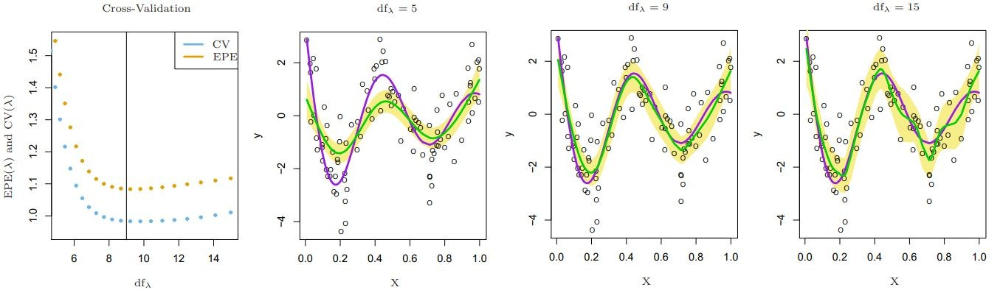
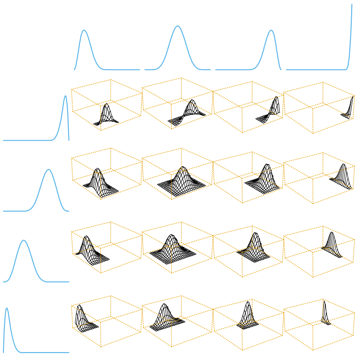
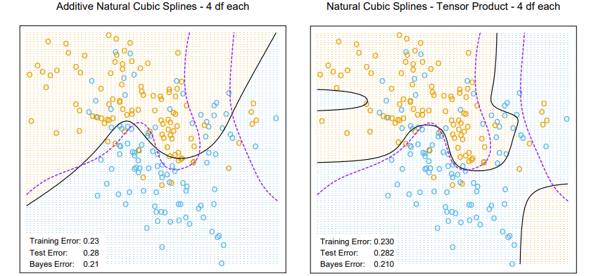
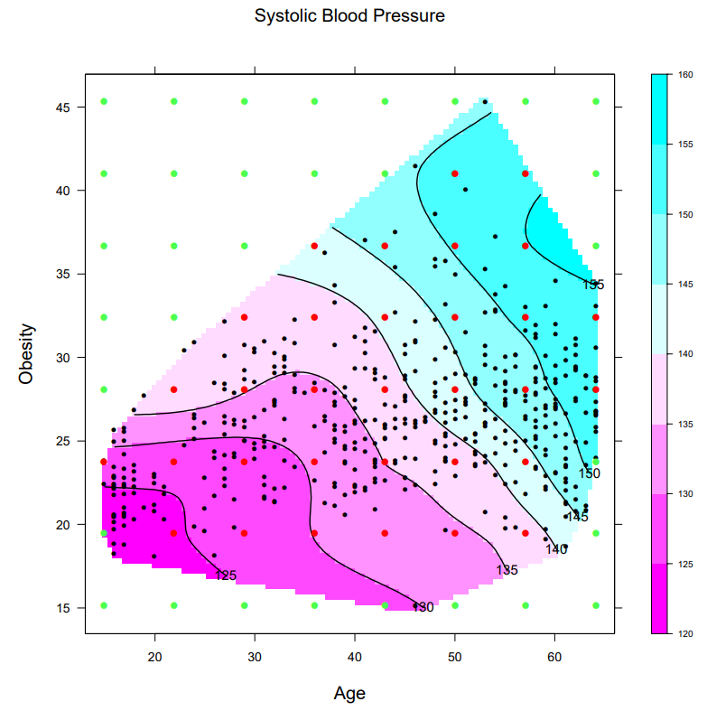

## 5.5. 平滑化パラメータの自動選択
平滑化スプラインは、ほとんど**3次**である。\
 &rarr; **データへのあてはめの良さ(第1項)** と **関数の歪曲度(第2項)** を調整する為に、\
 　 罰則パラメータ$\lambda$を選択することが重要である。

$$RSS(f, \lambda) = \sum^N_{i=1}\{ y_i - f(x_i) \}^2 + \lambda \int \{f''(t)\}^2 dt \tag{5.9}$$

---
一方、回帰スプラインでは、
1. スプラインの**次数**
2. 接点の**数**
3. 接点の**配置**

の3つの要素が平滑化パラメータとして含まれる。\
このパラメータを選択する事は複雑なタスクであり、MARSを使った近似解を使う。

---

## 5.5.1. 固定自由度
平滑化スプラインでは、$df_\lambda = trace(\mathrm S_\lambda)$ は$\lambda$に関して単調である。
 &rarr; **$df$を固定**すれば、$\lambda$を指定可能。

実際には、いくつかの異なる$df$を試して、近似的なf検定統計量や残差の図示等で、\
1つの$df$を選択する。特にGAM等で有効である。

- **一般化加法的モデル(GAM)** ... 各説明変数の一般的な変換の総和
$$y = \alpha + f_1 (x_1) + f_2 (x_2) + … + f_n (x_n) + \varepsilon$$
---

## 5.5.2. バイアスと分散のトレードオフ
スプラインにおいても、**バイアスと分散**の間に**トレードオフ**が存在する。
+ $df_\lambda$を**小さすぎる値**で当てはめると、真の関数とは異なる予測をしてしまう。
 (= バイアスが大きくなる / **過小適合**)
+ $df_\lambda$を**大きすぎる値**で当てはめると、予測が個々の標本に引っ張られやすくなる。
 (= 分散が大きくなる / **過剰適合**)

---
次ページに、以下の式で表される**単純な平滑化スプライン**を用いた際の$df_\lambda$の選択を
表す。ただし、$X \sim U[0,1]$、$\epsilon \sim N(0,1)$、$Cov(\hat f)$の対角成分が分散であり、$Bias(\hat f)$がバイアスである。
$$\begin{align}
Y &= f(X) + \epsilon \\
f(X) &= \frac{\sin(12 (X + 0.2))}{X + 0.2} \tag{5.22} \\
Cov(\hat f) &= \mathrm S_\lambda \mathrm S_\lambda^T \tag{5.23} \\
Bias(\hat f) &= \mathrm f - S_\lambda \mathrm f \tag{5.24}
\end{align}$$

---
以下の当てはめで、次のような問題が発生している。
- $df_\lambda = 5$ では、**過小な**当てはめ
- $df_\lambda = 9$ は、適切な当てはめ
- $df_\lambda = 15$ では、**過剰な**当てはめ

---

**期待2乗予測誤差$EPE$** により、バイアスと分散を1つに結び付けられる。
ただし、$\hat f_\lambda$は訓練標本、予測点$(X, Y)$の両方で平均化したものである。
$$ \begin{align}
EPE (f_\lambda) &= E(Y - \hat f_\lambda (X))^2 \\
&= Var(Y) + E\big[ Bias^2 (\hat f_\lambda (X) ) + Var(\hat f(X)) \big] \\
&= \sigma^2 + MSE(\hat f_\lambda) \tag{5.25} 
\end{align} $$

真の関数が未知なので、$EPE$は推測する必要がある。\
推測の方法としては、**$K$分割交差確認や$GCV$, $C_p$** 等がある。

---
## 5.6. ノンパラメトリックロジスティック回帰
**単一の定量的入力$X$** に対するロジスティック回帰を考える。\
ロジスティック関数$f(x)$による当てはめで、**滑らかな条件付き確率$Pr(Y = 1| x)$** を
求めることができる。
$$\begin{align}\log \frac{Pr(Y = 1| X = x)}{Pr(Y = 0| X = x)} &= f(x) \tag{5.28} \\
Pr(Y = 1|X=x) &= \frac{e^{f(x)}}{1+e^{f(x)}} \tag{5.29} \end{align}$$

---

**罰則付き対数尤度基準$l(f; \lambda)$** を、次式のように構成する。\
ただし、$p(x) = Pr(Y = 1| x)$である。
$$\begin{align}
l(f; \lambda) &= \sum^N_{i=1} [y_i \log p(x_i) + (1 - y_i)\log (1 - p(x_i))] - \frac{1}{2} \lambda \int \{f'' (x) \}^2 dt \\
&= \sum^N_{i=1} [y_i f(x_i) + \log (1 + e^{f(x_i)})] - \frac{1}{2} \lambda \int \{f'' (x) \}^2 dt 
\end{align} \tag{5.30}$$
この時、最適な$f$は$x$に接点を持つ自然スプラインなので、$f(x) = \sum^N_{j=1} N_j (x) \theta_j$

---

そして、1次と2次の導関数は以下のように表される。\
ただし、$p$は$p(x_i)$を要素として持つ$N$次元ベクトル、$W$は重み$p(x_i)(1 - p(x_i))$の対角行列である。
$$\begin{align}
\frac{\vartheta l(\theta)}{\vartheta \theta} &= N^T (y - p) - \lambda \Omega \theta \tag{5.31} \\
\frac{\vartheta ^2 l(\theta)}{\vartheta \theta \vartheta \theta^T} &= -N^T WN - \lambda\Omega\tag{5.32}
\end{align}$$

---

(5.31)は、**$\theta$について非線形**であるため、反復的な計算が必要である。\
**ニュートン=ラフソン アルゴリズム**を使って、$theta$の更新式を表せる。\
ただし、作業応答変数$z$は重み付き平滑化スプラインへの当てはめ、$S_\lambda$は回帰演算子である。
$$\begin{align}
\theta^{new} &= (N^T WN + \lambda \Omega)^{-1} NW (N \theta^{old} + W^{-1} (y-p)) \\
&= (N^T WN + \lambda \Omega)^{-1} NWz
\end{align} \tag{5.33}$$
$$\begin{align}
f^{new} &= N(N^T WN + \lambda \Omega)^{-1} N^T W (f^{old} + W^{-1} (y-p)) \\
&= S_{\lambda, w} z
\end{align} \tag{5.34}$$

ニュートン=ラフソン アルゴリズム ... 非線形方程式$f(x) = 0$を**数値的に解く方法**

---

## 5.7. 多次元スプライン
スプラインを多次元で扱うために、基底を追加する。
1. 座標$X_1$ の関数を表す$M_1$個の基底$h_1j(X_j)$ 　 $(j = 1, ..., M_1)$
2. 座標$X_2$ の関数を表す$M_2$個の基底$h_2k(X_k)$ 　 $(k = 1, ..., M_2)$

これらによって定義される$M_1 \times M_2$次元の**テンソル積基底**を導入する。\
これは、2次関数を表現するのに使える。
$$g_{jk}(X) = h_{1j}(X_1) h_{2k}(X_2) 　 (j = 1, ..., M_1) (k = 1, ..., M_2)$$

---

**Bスプライン**を用いたテンソル積基底で、多次元スプラインも示せる。\
係数は最小2乗法で求めており、MARSに近い挙動を取る。
しかし、次元数が増えると**テンソル積基底は指数関数的に増え**、次元の呪いが生じてしまう。

ロジスティック回帰による当てはめも、テンソル積基底によるスプラインを示せる。\
決定境界において**柔軟性**があるが、その他の部分では、**誤分類**してしまいやすい。

---

 

  
 

 

  左図はBスプラインで求めた<strong>テンソル基底</strong>である。 
  黄線部の各2次元関数は、左と上の対応する1次元関数の<strong>テンソル積</strong>である。  
  テンソル積 ... 既知のベクトル空間から<strong>ベクトル空間を作る</strong>こと。
 

---

以下の図は、加法的基底(左)とテンソル積基底(右)の違いを示した図である。
応答はロジスティック回帰$logit [Pr(T|x)] = h(x)^T \theta$、決定境界は$h(x)^T\hat\theta=0$である

---

一般化平滑化スプラインも高次元に**一般化**できる。
$x_i \in R^d$である組$y_i, x_i$が与えられた時、$d$次元回帰関数$f(x)$を求める。
$$\underset{f}{min} \sum^N_{i_1} \{ y_i - f(x_i) \}^2 + \lambda J[f] \tag{5.37}$$
$J$は関数$f$を安定させるための**適切な罰則関数**である。
$$J[f] = \int \int_{R^2} \bigg[\bigg(\frac{\vartheta^2 f(x)}{\vartheta x_1^2}\bigg)^2 + 2\bigg(\frac{\vartheta^2 f(x)}{\vartheta x_1 \vartheta x_2}\bigg)^2 + \bigg(\frac{\vartheta^2 f(x)}{\vartheta x_2^2}\bigg)^2\bigg]dx_1 dx_2 \tag{5.38}$$

---

この罰則による式の最適化は、**薄板スプライン (Thin-plate Spline)** の名前で知られ、以下の特徴がある。
1. 滑らかな2次元の表面が得られる。
2. 式(5.37)の$\lambda$に関して、以下の規則がある。
 2.1. $\lambda \rightarrow 0$の時、解は**補完関数**に近づく。(全てのデータ点を通る)
 2.2. $\lambda \rightarrow \infty$の時、解は**最小2乗平面**に近づく。 ($d$次元空間中の平面/超平面)
 2.3. その他の$\lambda$に関しては、 係数が一般化リッジ回帰で表される基底関数の
 線型展開として表される。
 ただし、**動径基底関数(radial basis function)** $h_j(x) = \| x - x_j \|^2 \log \| x - x_j \|$
 $$f(x) = \beta_0 + \beta^T x + \sum^N_{j=1} \alpha_j h_j(x) \tag{5.39}$$

---

より一般的で**適切な$J$** を選べば、薄板スプラインは任意の次元$d$へと**一般化**できる。\
しかし、**計算量は$O(N^3)$と膨大**になる。\
$\rightarrow$ 実用上では、領域を覆う接点の格子を用いれば基本問題ない。\
 　 $K$接点$(K < N)$を元にすると計算量は$O(NK^2+K^3)$まで減らせる。

また、$f \in R^d$は任意の数の基底関数の集合による展開として表現できる。\
そのため、式(5.38)のように**正則化**が可能であり、複雑さを調整できる。

---

 

  
 

 

  左図は薄板スプラインを<strong>心臓病のリスク要因</strong>に当てはめたものである。 
  等高線図を平面で表している。 
  入力の特徴の位置に加えて、<strong>当てはめに用いた接点</strong>も表示している。
  ただし、外側の緑の接点は、<strong>利用されていない</strong>。 
 

---

**加法的スプラインモデル**は、多次元スプラインを**制限**したクラスである。
座標$X_d$ の関数$f_d$が存在し、以下の式が成り立つ。
$$f(X) = \alpha + \sum^d_{j=1} f_j (X_j)$$
また、それぞれの$f_j$が**1変量スプラインであることを保証する罰則**$J[f]$が存在し、以下の通りである。
$$\begin{align}
J[f] &= J (f_1 + f_2 + ... + f_d) \\
&= \sum^d_{j=1} \int f_j'' (t_j)^2 dt_j
\end{align} \tag{5.40}$$

---

この際、各要素は**所望の次元**を持つスプラインであり、多数の**選択の余地**がある。
1. 相互作用の**最大次数**
2. どの項を含むべきか
3. その表現を用いるべきか
 3.1. **比較的少数**の座標ごとの基底関数と、相互作用のためのテンソル積
 3.2. **全基底**を用いた展開に、各項への適切な**正則化**を加えたもの

---

## 参考文献
[1] 一般化加法モデル（GAM）について考える - rmizutaの日記 (参照:2025/06/02)
https://rmizutaa.hatenablog.com/entry/2019/03/23/201720

[2] テンソル積 - Wikipedia (参照:2025/06/04)
https://ja.wikipedia.org/wiki/%E3%83%86%E3%83%B3%E3%82%BD%E3%83%AB%E7%A9%8D

[3] Pythonでやってみた(Engineering)：方程式の数値解法／ニュートン・ラフソン法｜KIYO (参照:2025/06/03)
https://note.com/kiyo_ai_note/n/n197ec395055a

---

[4] 補間関数と予測関数について (参照:2025/06/04)
https://support.ptc.com/help/mathcad/r10.0/ja/index.html#page/PTC_Mathcad_Help/about_interpolation_and_prediction_functions.html

[5] 点群にフィットする平面を最小二乗法で求める方法 - 理数アラカルト
(参照:2025/06/04)
https://risalc.info/src/fitting-plane-least-squared.html

